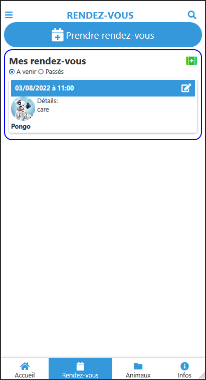

# App-clinique-veterinaire-du-vernais

## Description
Application mobile: clinique vétérinaire du Vernais.
Developpée avec le framework JavaScript : **svelte**
dans le cadre du :
**Master 2 ILSEN CERI - 2021/2022**
**UE E-Commerce**
**ECUE E-Commerce et E-mobilité**

## Equipe
- Miora RABEFANDROANA
- Houssainatou BAH

## Organisation du répertoire
- [App](App) : le projet svelte
- [maquettes](maquettes) : les maquettes

## Screenshots

